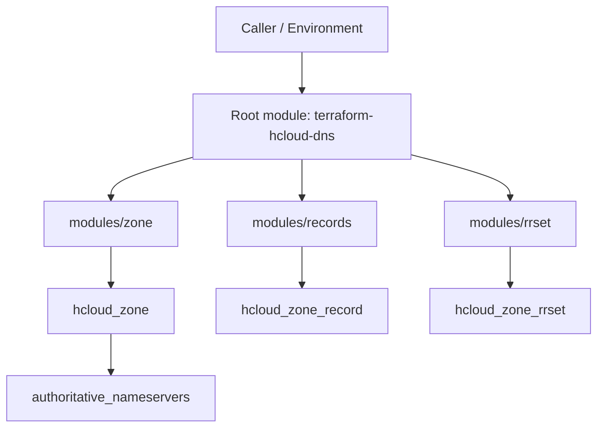

## Architecture

This repository provides:

- The **root module** to manage a DNS zone and (optionally) its records.
- Submodules for **zone**, **records** and **rrset**.

### High-level flow

```mermaid
flowchart TB
  caller[Caller / Environment] --> root[Root module: terraform-hcloud-dns]

  root --> zone_mod[modules/zone]
  root --> rec_mod[modules/records]
  root --> rrset_mod[modules/rrset]

  zone_mod --> zone[hcloud_zone]
  rec_mod --> rec[hcloud_zone_record]
  rrset_mod --> rrset[hcloud_zone_rrset]

  zone --> ns[authoritative_nameservers]
```
